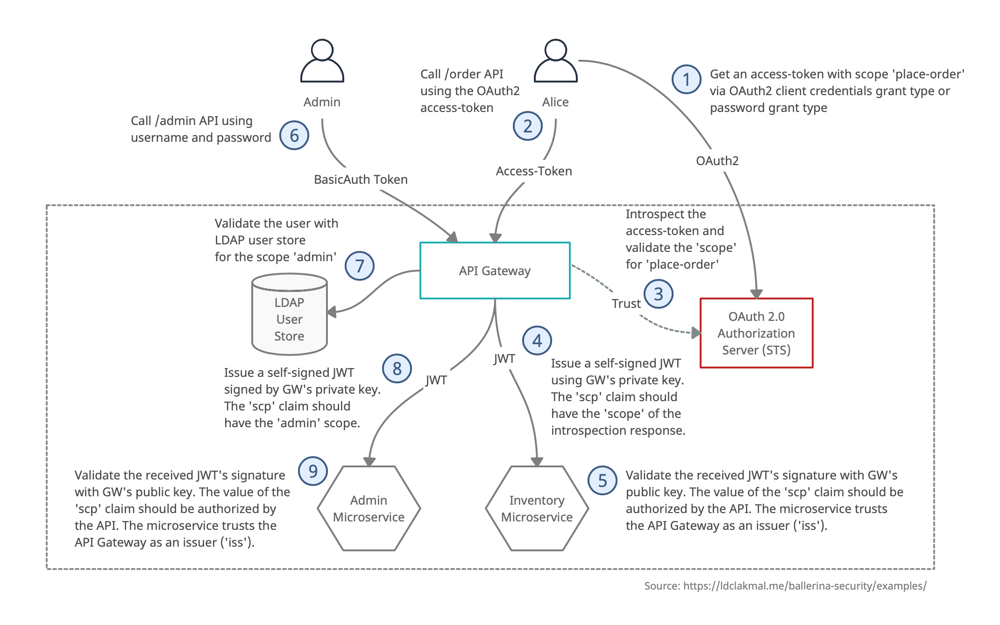

# Scenario 1

### Resources

- User Admin & Alice
- OAuth 2.0 Authorization Server (STS)
- Ballerina API Gateway
- Ballerina Admin Microservice
- Ballerina Inventory Microservice

### Steps

1. User `Alice` gets an access-token with scope `place-order` via OAuth2 client credentials grant type or OAuth2 password grant type from _OAuth 2.0 Authorization Server (STS)_.
2. User `Alice` calls `/order` API of the _Ballerina API Gateway_ using the received OAuth2 access-token.
3. _Ballerina API Gateway_ introspects the received access-token against the _OAuth 2.0 Authorization Server (STS)_ and validate the `scope` for `place-order`.
4. _Ballerina API Gateway_ issues a self-signed JWT signed by Gateway's private key. The `scp` claim should have the `scope` received from the introspection response, which is `place-order`. Calls the _Ballerina Inventory Microservice_ using that JWT.
5. _Ballerina Inventory Microservice_ validates the received JWT's signature with Gateway's public key. The value of the `scp` claim should be authorized by the API. The microservice trusts the API Gateway as an issuer (`iss`).
6. User `Admin` calls `/admin` API using username and password.
7. _Ballerina API Gateway_ validates the user against LDAP user store for the scope `Admin`.
8. _Ballerina API Gateway_ issues a self-signed JWT signed by Gateway's private key. The `scp` claim should  have the `Admin` scope. Calls the _Ballerina Admin Microservice_ using that JWT.
9. _Ballerina Admin Microservice_ validate the received JWT's signature with Gateway's public key. The value of the `scp` claim should be authorized by the API. The microservice trusts the API Gateway as an issuer (`iss`).
10. If all the requests get successful, the user `Alice` and `Admin` should get success responses. If not, 401/403 responses.
