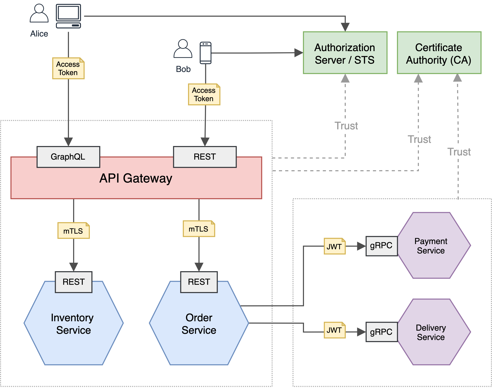

# E-Commerce System

> [**Source Code**](https://github.com/ldclakmal/ballerina-security/tree/master/scenarios/e-commerce-system)

### Description

An e-commerce system that can be used to search for items and purchase items. 

The end-user (customer), in this example, **Alice** and **Bob**, interacts with the system using the web/mobile app provided. This web/mobile app acts as a **Client** on behalf of the user's actions.

We have two trust domains; the left side trust domain is allowed any HTTPS inbound traffic, and the right side trust domain is allowed the inbound traffic only from the left side trust domain. The system trusts the **Authorization Server / STS** and the **Certificate Authority (CA)** which are configured for this system.

In the left side trust domain, we have an **API Gateway**, which has both REST APIs and GraphQL APIs. The API Gateway routes the GraphQL API requests to **Inventory Service**, which is responsible for managing the inventory of the system, and the REST API requests to **Order Service**, which is responsible for processing the order for the customer.
In the right side trust domain, we have **Payment Service** and **Delivery Service** with gRPC APIs, which are called by the **Order Service** of the left trust domain only to process the payment and delivery.

All the APIs are authenticated with different types and different levels of authentication mechanisms such as JWT auth, OAuth2, TLS, mTLS etc.

### Design

### Resources

- Customer Alice & Bob
- API Gateway
- Inventory Service
- Order Service
- Payment Service
- Delivery Service
- Authorization Server/STS [Reference: [WSO2 IS STS](https://hub.docker.com/r/ldclakmal/wso2is-sts)]
- Certificate Authority (CA)
