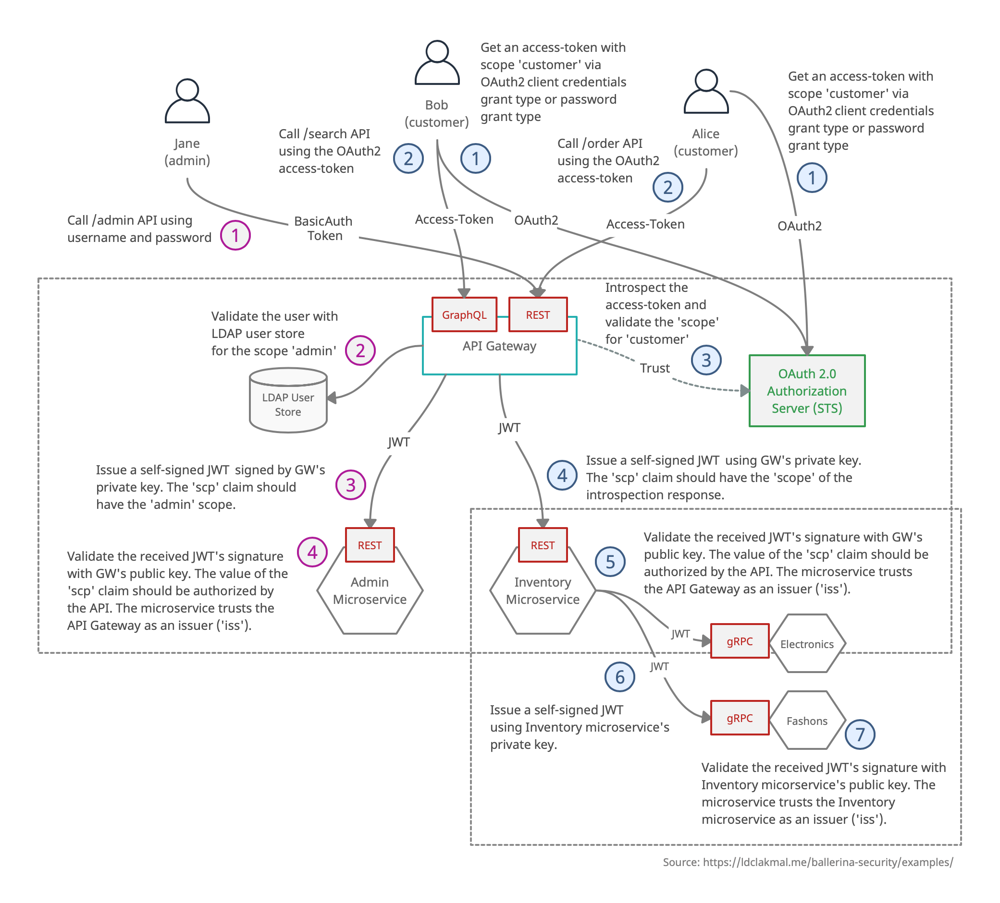

# Scenario 2

### Description

Advanced inventory management system, with 4 secured microservices, and a secured API gateway, which connects to an LDAP user store and trusts OAuth2 authorization server.

User `Jane`, the admin, connects to `Admin Microservice` through the REST API of API gateway using HTTPS for management purposes. User `Alice`, a customer, connects to `Inventory Microservice` through the REST API of API gateway using HTTPS for purchasing items. User `Bob`, another customer, connects to `Inventory Microservice` through the GraphQL API of API gateway using HTTPS for searching items. `Electronic` and `Fashions` microservices are connected to `Inventory Microservice` and can be accessed via gRPC APIs. All the HTTP, GraphQL, gRPC APIs are authenticated with different types of authentication mechanisms such as basic auth, JWT auth, OAuth2, etc., and secured with TLS as well.

### Resources

- User Jane (admin), Alice (customer), and Bob (customer)
- API Gateway
- Admin, Inventory, Electronics and Fashions Microservices
- OAuth 2.0 Authorization Server (STS) [Reference: [WSO2 IS STS](https://hub.docker.com/r/ldclakmal/wso2is-sts)]
- LDAP User Store [Reference: [How to Start OpenLDAP Server with User Data](https://ldclakmal.me/ballerina-security/guides/how-to-start-open-ldap-server.html)]

### Steps

#### Jane (admin)

1. User `Jane` calls basic-auth secured `/admin` **REST API** using username and password.
2. _Ballerina API Gateway_ validates the user against LDAP user store for the scope `Admin`.
3. _Ballerina API Gateway_ issues a self-signed JWT signed by Gateway's private key. The `scp` claim should  have the `Admin` scope. Calls the JWT secured **REST API** of_Ballerina Admin Microservice_ using that JWT.
4. _Ballerina Admin Microservice_ validates the received JWT's signature with Gateway's public key. The value of the `scp` claim should be authorized by the API. The microservice trusts the API Gateway as an issuer (`iss`).

> If successful, `Jane` should get a success responses from `Admin Microservice`. If not, a 401 or 403 response.

#### Alice (customer)

1. User `Alice` gets an access token with scope `customer` via OAuth2 client credentials grant type or OAuth2 password grant type from _OAuth 2.0 Authorization Server (STS)_.
2. `Alice` calls OAuth2 secured `/order` **REST API** of the _Ballerina API Gateway_ using the received OAuth2 access token.
3. _Ballerina API Gateway_ introspects the received access token against the _OAuth 2.0 Authorization Server (STS)_ and validates the `scope` for the `customer`.
4. _Ballerina API Gateway_ issues a self-signed JWT signed by Gateway's private key. The `scp` claim should have the `scope` received from the introspection response, which is the `customer`. Calls the JWT secured **REST API** of _Ballerina Inventory Microservice_ using that JWT.
5. _Ballerina Inventory Microservice_ validates the received JWT's signature with Gateway's public key. The value of the `scp` claim should be authorized by the API. The microservice trusts the API Gateway as an issuer (`iss`).
6. _Ballerina Inventory Gateway_ issues a self-signed JWT signed by inventory microservice's private key. Calls the JWT secured **gRPC API** of _Ballerina Electronics Microservice_ or _Ballerina Fashions Microservice_ using that JWT.
7. _Ballerina Electronics Microservice_ or _Ballerina Fashions Microservice_ validates the received JWT's signature with the inventory microservice's public key. The microservice trusts the inventory microservice as an issuer (`iss`).

> If successful, `Alice` should get a success response from `Inventory Microservice`. If not, a 401 or 403 response.

#### Bob (customer)

1. User `Bob` gets an access token with scope `customer` via OAuth2 client credentials grant type or OAuth2 password grant type from _OAuth 2.0 Authorization Server (STS)_.
2. `Bob` calls OAuth2 secured `/search` **GraphQL API** of the _Ballerina API Gateway_ using the received OAuth2 access token.
3. _Ballerina API Gateway_ introspects the received access token against the _OAuth 2.0 Authorization Server (STS)_ and validate the `scope` for the `customer`.
4. _Ballerina API Gateway_ issues a self-signed JWT signed by Gateway's private key. The `scp` claim should have the `scope` received from the introspection response, which is the `customer`. Calls the JWT secured **REST API** of _Ballerina Inventory Microservice_ using that JWT.
5. _Ballerina Inventory Microservice_ validates the received JWT's signature with Gateway's public key. The value of the `scp` claim should be authorized by the API. The microservice trusts the API Gateway as an issuer (`iss`).
6. _Ballerina Inventory Gateway_ issues a self-signed JWT signed by inventory microservice's private key. Calls the JWT secured **gRPC API** of _Ballerina Electronics Microservice_ or _Ballerina Fashions Microservice_ using that JWT.
7. _Ballerina Electronics Microservice_ or _Ballerina Fashions Microservice_ validates the received JWT's signature with the inventory microservice's public key. The microservice trusts the inventory microservice as an issuer (`iss`).

> If successful, `Bob` should get a success response from `Electronics Microservice` or `Fashions Microservice`. If not, a 401 or 403 response.
